# Strands Agents – Semantic Summarizing Conversation Manager

A conversation management system for Strands Agents that combines summarization with exact message recall using semantic search.

## Features

- **Hybrid Memory**: Combines summarization (for context management) with exact recall (for detailed history)
- **Semantic Search**: Uses embeddings to find relevant historical messages
- **Context Radius**: Includes surrounding messages for better context
- **Automatic Enrichment**: Hook system automatically adds relevant history to new queries
- **Intelligent Overlap**: Merges overlapping message ranges to avoid duplicates
- **Memory Limits**: Configurable limits by message count or memory usage with automatic cleanup
- **Memory Monitoring**: Real-time memory usage statistics and tracking

## Components

### 1. SemanticSummarizingConversationManager
Located in `semantic_conversation_manager.py`

- Extends the base conversation manager with semantic memory capabilities
- Stores exact messages with semantic indexing for intelligent retrieval
- Configurable context radius for including surrounding messages
- Memory limits by message count or total memory usage
- Real-time memory usage statistics and monitoring

### 2. SemanticMemoryHook
Located in `semantic_memory_hook.py`

- Automatically enriches user messages with relevant historical context
- Searches semantic memory when new messages are added
- Provides natural, contextual message enhancement

### 3. SemanticSearch
Located in `semantic_search.py`

- Semantic search engine with sentence transformers and cross-encoder reranking
- Supports document indexing, searching, and persistence
- Provides relevance scoring and configurable result filtering

## Installation

Install dependencies

```bash
uv sync
```

## Usage

```python
from strands import Agent
from semantic_conversation_manager import SemanticSummarizingConversationManager
from semantic_memory_hook import SemanticMemoryHook

# Create the conversation manager with defaults
conversation_manager = SemanticSummarizingConversationManager()  # Using defaults

# Or use custom parameters in the initialization
conversation_manager = SemanticSummarizingConversationManager(
    summary_ratio=0.3,                      # Summarize 30% of messages on overflow
    preserve_recent_messages=8,             # Keep 8 most recent messages
    message_context_radius=2,               # Include 2 messages before/after
    semantic_search_top_k=3,                # Find top 3 relevant messages
    semantic_search_min_score=-2.0,         # Default: balanced relevance threshold
    max_num_archived_messages=1000,         # Optional: limit by message count
    max_memory_archived_messages=50*1024*1024,  # Optional: limit by memory usage (50MB)

    # Embedding model configuration (optional)
    embedding_model="all-MiniLM-L12-v2",    # Default: local sentence-transformers model
    # embedding_model="bedrock:amazon.titan-embed-text-v2:0",  # Alternative: embedding model in Amazon Bedrock
    # aws_region="us-west-2",                # Optional: AWS Region (uses AWS SDK default if not specified)
    # embedding_dimensions=512,              # Optional: for models with variable dimensions
)

# Create the hook
semantic_hook = SemanticMemoryHook(
    enabled=True,
    max_context_length=2000,
    include_metadata=True
)

# Create agent with semantic memory
agent = Agent(
    name="MemoryAgent",
    model="us.amazon.nova-lite-v1:0",  # Use US Amazon Nova Lite for efficient processing
    conversation_manager=conversation_manager,
    hooks=[semantic_hook]
)

# Use normally - semantic memory works automatically after the first summarization
response = agent("Let me tell <something>...")
# ... many messages later ...
response = agent("What did I say exactly about <something>")  # Will recall earlier context

# Monitor memory usage
stats = agent.conversation_manager.get_memory_usage_stats()
print(f"Messages stored: {stats['message_count']}")
print(f"Total memory: {stats['total_memory']:,} bytes")

# Get human-readable summary
print(agent.conversation_manager.get_memory_usage_summary())
```

## How It Works

### Overview

The system maintains two types of memory:
1. **Active conversation** - Recent messages visible to the agent
2. **Archived messages** - Historical messages stored with embeddings for intelligent retrieval

When context overflows, older messages are summarized for the active conversation but preserved in full in archived messages. A hook automatically enriches new user messages with relevant historical context.

### Phase 1: Before First Summarization
*When the conversation starts, archived messages are empty*

```mermaid
%%{init: {"theme": "base", "themeVariables": {"primaryColor": "#4CAF50", "primaryTextColor": "#000", "primaryBorderColor": "#388E3C", "lineColor": "#2196F3", "secondaryColor": "#FFC107", "tertiaryColor": "#FFF3E0", "edgeLabelBackground": "#FFF3E0"}}}%%
graph LR
    %% Node styles
    classDef userStyle fill:#E3F2FD,stroke:#1976D2,stroke-width:3px,color:#000
    classDef agentStyle fill:#F3E5F5,stroke:#7B1FA2,stroke-width:3px,color:#000
    classDef activeStyle fill:#E8F5E9,stroke:#388E3C,stroke-width:3px,color:#000
    classDef emptyStyle fill:#FFF3E0,stroke:#F57C00,stroke-width:2px,stroke-dasharray:5 5,color:#666
    classDef hookStyle fill:#FCE4EC,stroke:#C2185B,stroke-width:2px,color:#000

    %% Nodes
    User[👤 User]
    Hook[🔗 Hook]
    Agent[🤖 Agent]
    ActiveConv[📝 Active Conversation<br/><br/>Message 1: Hello<br/>Message 2: Hi there<br/>Message 3: Tell me about X<br/>Message 4: X is...]
    ArchivedMessages[🗄️ Archived Messages<br/><br/>EMPTY]
    SemanticIndex[📊 Semantic Index<br/><br/>EMPTY]

    %% Connections with labels
    User -->|"1. New message:<br/>'What about Y?'"| Hook
    Hook -->|"2. Check archived messages<br/>(finds nothing)"| ArchivedMessages
    Hook -->|"3. Pass original message<br/>(no enrichment)"| Agent
    Agent -->|"4. Read context"| ActiveConv
    Agent -->|"5. Generate response<br/>using only active messages"| User

    %% Apply styles
    class User userStyle
    class Agent agentStyle
    class ActiveConv activeStyle
    class ArchivedMessages,SemanticIndex emptyStyle
    class Hook hookStyle

    %% Notes
    ActiveConv -.- Note1[All messages fit<br/>in context window]
    ArchivedMessages -.- Note2[No archived<br/>messages yet]

    style Note1 fill:#FFFFFF,stroke:#999,stroke-width:1px,stroke-dasharray:3 3,color:#666
    style Note2 fill:#FFFFFF,stroke:#999,stroke-width:1px,stroke-dasharray:3 3,color:#666
```



**Example:**
```
User: "Tell me about Python decorators"
Agent sees: Just the current message and recent conversation (messages 1-4)
Response: Based on the active conversation context
```

### Phase 2: After Summarization(s)
*After context overflow triggers summarization, archived messages become available for retrieval*

```mermaid
%%{init: {"theme": "base", "themeVariables": {"primaryColor": "#4CAF50", "primaryTextColor": "#000", "primaryBorderColor": "#388E3C", "lineColor": "#2196F3", "secondaryColor": "#FFC107", "tertiaryColor": "#FFF3E0", "edgeLabelBackground": "#FFF3E0"}}}%%
graph LR
    %% Node styles
    classDef userStyle fill:#E3F2FD,stroke:#1976D2,stroke-width:3px,color:#000
    classDef agentStyle fill:#F3E5F5,stroke:#7B1FA2,stroke-width:3px,color:#000
    classDef activeStyle fill:#E8F5E9,stroke:#388E3C,stroke-width:3px,color:#000
    classDef populatedStyle fill:#FFF3E0,stroke:#FF9800,stroke-width:3px,color:#000
    classDef hookStyle fill:#FCE4EC,stroke:#C2185B,stroke-width:2px,color:#000
    classDef enrichedStyle fill:#E1F5FE,stroke:#0288D1,stroke-width:3px,color:#000

    %% Nodes
    User[👤 User]
    Hook[🔗 Hook]
    Agent[🤖 Agent]
    ActiveConv[📝 Active Conversation<br/><br/>Summary: Topics A, B, C...<br/>Message 21: About Z<br/>Message 22: Z means...<br/>Message 23: More on Z]
    SemanticIndex[📊 Semantic Index<br/><br/>Embeddings for<br/>messages 1-20]
    ArchivedMessages[🗄️ Archived Messages<br/><br/>Message 1: Hello<br/>Message 2: Hi there<br/>...<br/>Message 20: About Y]
    EnrichedMsg[💬 Enriched Message]

    %% Connections with detailed labels
    User -->|"1. New message:<br/>'What exactly did I<br/>say about decorators?'"| Hook
    Hook -->|"2. Query semantic index<br/>with embeddings"| SemanticIndex
    SemanticIndex -->|"3. Return relevant<br/>message IDs<br/>(e.g., 5, 6, 7)"| Hook
    Hook -->|"4. Retrieve exact<br/>messages + context<br/>(radius = 2)"| ArchivedMessages
    ArchivedMessages -->|"5. Return messages<br/>3-9 (with overlap merge)"| Hook
    Hook -->|"6. Create enriched message"| EnrichedMsg
    EnrichedMsg -->|"7. Pass augmented<br/>message to agent"| Agent
    Agent -->|"8. Read current<br/>context"| ActiveConv
    Agent -->|"9. Generate response<br/>with full history"| User

    %% Apply styles
    class User userStyle
    class Agent agentStyle
    class ActiveConv activeStyle
    class SemanticIndex,ArchivedMessages populatedStyle
    class Hook hookStyle
    class EnrichedMsg enrichedStyle

    %% Enriched message example
    EnrichedMsg -.- ExampleMsg[<b>Enriched Message:</b><br/>---Previous Context---<br/>Message 5: Tell me about decorators<br/>Message 6: Decorators are functions...<br/>Message 7: @decorator syntax<br/>---End Context---<br/>Current: What exactly did I say?]

    style ExampleMsg fill:#E1F5FE,stroke:#0288D1,stroke-width:1px,stroke-dasharray:3 3,color:#000,text-align:left
```



**Example with actual messages:**
```
User: "What exactly did I say about decorators?"

Hook enriches the message to:
"Based on our previous conversation, these earlier exchanges may be relevant:
---Previous Context---
[Message 5, user]: Tell me about Python decorators
[Message 6, assistant]: Python decorators are functions that modify...
[Message 7, user]: Can you show an example with @property?
---End Previous Context---
Current question: What exactly did I say about decorators?"

Agent sees: Enriched message + current active conversation (summary + recent messages)
Response: "You specifically asked about decorators and requested an example with @property..."
```

### Key Components Explained

1. **Agent State Storage**
   - `archived_messages`: Full text of all historical messages
   - Stored in agent's K/V state for persistence
   - Never lost, even after summarization

2. **Semantic Index**
   - Embeddings for each archived message
   - Enables similarity search
   - Built incrementally as messages are archived

3. **Context Radius**
   - When finding relevant message N, also includes N-2, N-1, N+1, N+2
   - Provides surrounding context for better understanding
   - Overlapping ranges are automatically merged

4. **Summary Generation**
   - Older messages compressed into a summary
   - Summary replaces original messages in active conversation
   - Original messages preserved in archived messages

### Memory Flow Timeline

```mermaid
%%{init: {"theme": "base"}}%%
timeline
    title Conversation Lifecycle with Semantic Memory

    Messages 1-10 : Active conversation growing
                  : Archived messages empty
                  : All messages in context

    Context Overflow : Messages 1-7 summarized
                     : Messages 1-7 → archived messages
                     : Messages 1-7 indexed with embeddings
                     : Summary + messages 8-10 active

    Messages 11-20 : New messages added
                   : Summary + recent messages active
                   : Archived messages has messages 1-7

    Second Overflow : Messages 8-17 summarized
                    : Messages 8-17 → archived messages
                    : New summary + messages 18-20 active
                    : Archived messages has messages 1-17

    Query Time : User asks about old topic
               : Hook searches semantic index
               : Retrieves relevant messages
               : Enriches user message
               : Agent responds with full context
```



## Architecture

The system uses a clean layered architecture that eliminates complex connections:

```mermaid
%%{init: {"theme": "base", "themeVariables": {"primaryColor": "#F5F5F5", "primaryTextColor": "#000", "primaryBorderColor": "#9E9E9E", "lineColor": "#2196F3", "secondaryColor": "#FFC107", "tertiaryColor": "#FFF3E0", "edgeLabelBackground": "#FFFFFF"}}}%%
graph TB
    %% Define styles for each layer
    classDef userLayer fill:#E3F2FD,stroke:#1976D2,stroke-width:3px,color:#000
    classDef processLayer fill:#F3E5F5,stroke:#7B1FA2,stroke-width:3px,color:#000
    classDef storageLayer fill:#E8F5E9,stroke:#388E3C,stroke-width:3px,color:#000
    classDef invisible fill:transparent,stroke:none

    %% Layer 1: User Interaction
    subgraph L1 [" 📱 User Interaction Layer "]
        User[👤 User]
        Spacer1[ ]
        Agent[🤖 Agent]
    end

    %% Layer 2: Processing Orchestration
    subgraph L2 [" ⚙️ Processing Layer "]
        Hook[🔗 Memory Hook<br/><br/>• Intercepts messages<br/>• Searches semantic index<br/>• Enriches with context]
        Spacer2[ ]
        CM[💭 Conversation Manager<br/><br/>• Context overflow detection<br/>• Summarization coordination<br/>• Storage orchestration]
    end

    %% Layer 3: Storage Components
    subgraph L3 [" 💾 Storage Layer "]
        Active[📝 Active Messages<br/><br/>Current visible<br/>conversation]
        State[🗄️ Agent State<br/><br/>archived_messages<br/>full history]
        Index[📊 Semantic Index<br/><br/>embeddings<br/>searchable]
    end

    %% Apply styles
    class User,Agent userLayer
    class Hook,CM processLayer
    class Active,State,Index storageLayer
    class Spacer1,Spacer2 invisible

    %% Layer 1: User interaction
    User ---|Messages| Agent

    %% Processing connections
    Agent <-->|Intercept &<br/>Enrich| Hook
    Agent -->|Context<br/>Overflow| CM

    %% Storage operations (solid lines from CM)
    CM -->|Update| Active
    CM -->|Archive| State
    CM -->|Index| Index

    %% Memory retrieval (dashed lines from Hook)
    Hook -.->|Query| Index
    Hook -.->|Retrieve| State

    %% Hide spacer connections
    Spacer1 ~~~ User
    Spacer1 ~~~ Agent
    Spacer2 ~~~ Hook
    Spacer2 ~~~ CM
```



## Process Flow

Here's how the system handles a typical conversation with memory retrieval:

```mermaid
%%{init: {"theme": "base", "themeVariables": {"actorBkg": "#e3f2fd", "actorBorder": "#1976d2", "actorTextColor": "#000", "activationBkgColor": "#fff3e0", "activationBorderColor": "#ff9800"}}}%%
sequenceDiagram
    participant U as 👤 User
    participant A as 🤖 Agent
    participant CM as 💭 ConversationManager
    participant H as 🔗 MemoryHook
    participant SE as 🔍 SemanticEngine
    participant KV as 💾 K/V State

    rect rgb(240, 248, 255)
        Note over U,KV: 📝 Normal Conversation Flow
        U->>+A: New message
        A->>+CM: Check context size

        alt Context overflow occurs
            CM->>+SE: Index old messages
            CM->>+KV: Store exact messages
            CM->>A: Replace with summary
            SE->>SE: Build embeddings
            KV-->>-CM: ✅ Stored
            SE-->>-CM: ✅ Indexed
        end
        CM-->>-A: Ready
        A-->>-U: Response
    end

    rect rgb(248, 255, 248)
        Note over U,KV: 🧠 Memory-Enhanced Query
        U->>+A: Question about old topic
        A->>+H: MessageAddedEvent triggered
        H->>+SE: Search for relevant messages
        SE->>SE: Embed query & search
        SE->>SE: Rerank with cross-encoder
        SE->>-H: Return relevant messages
        H->>+KV: Get full message content
        KV-->>-H: Historical context
        H->>A: Enrich user message with context
        A->>A: Generate response with history
        A-->>-U: ✨ Answer with recalled context
        H-->>-A: Context injected
    end
```



## Configuration

### SemanticSummarizingConversationManager

- `summary_ratio` (0.1-0.8): Percentage of messages to summarize
- `preserve_recent_messages`: Number of recent messages to always keep
- `message_context_radius`: Messages before/after to include (default: 2)
- `semantic_search_top_k`: Number of relevant messages to retrieve
- `semantic_search_min_score`: Minimum relevance score threshold (cross-encoder logits; default: -2.0 for balanced precision/recall)
- `max_num_archived_messages`: Optional maximum number of archived messages to keep (default: None = no limit)
- `max_memory_archived_messages`: Optional maximum memory usage in bytes for archived messages and embeddings (default: None = no limit)

### SemanticMemoryHook

- `enabled`: Turn the hook on/off
- `max_context_length`: Maximum characters for injected context
- `include_metadata`: Include message indices in context

## Embedding Models

The system supports configurable embedding models for semantic search:

### Model Types

**Local Models** (default, via sentence-transformers):
- `"all-MiniLM-L12-v2"` - 384 dimensions (default)
- `"all-MiniLM-L6-v2"` - 384 dimensions
- `"all-mpnet-base-v2"` - 768 dimensions
- Any model from [Hugging Face sentence-transformers](https://huggingface.co/models?library=sentence-transformers)

**Amazon Bedrock Embedding Models** (cloud-based):
- `"bedrock:amazon.titan-embed-text-v1"` - 1536 dimensions
- `"bedrock:amazon.titan-embed-text-v2:0"` - 256/512/1024 dimensions (configurable)
- `"bedrock:cohere.embed-english-v3"` - 1024 dimensions

### Configuration Examples

```python
# Default local model
manager = SemanticSummarizingConversationManager()

# Specific local model
manager = SemanticSummarizingConversationManager(
    embedding_model="all-mpnet-base-v2"
)

# Amazon Bedrock model
manager = SemanticSummarizingConversationManager(
    embedding_model="bedrock:amazon.titan-embed-text-v2:0",
    aws_region="us-west-2",  # Optional: uses AWS SDK default if not specified
    embedding_dimensions=512  # Optional: 256, 512, or 1024
)
```

### Amazon Bedrock Setup

For Bedrock models, configure AWS credentials or an Amazon Bedrock API key.

## Example Output

When you ask about something discussed earlier:

```
Based on our previous conversation, these earlier exchanges may be relevant:
---Previous Context---
[Message 5, user]: Tell me about Python decorators
[Message 6, assistant]: Python decorators are functions that modify...
[Message 7, user]: Can you show an example?
---End Previous Context---

Current question: What was the exact decorator syntax you showed earlier?
```

## File Structure

- `semantic_conversation_manager.py` - Main semantic conversation manager with memory limits
- `message_container.py` - Message storage with automatic semantic indexing
- `semantic_memory_hook.py` - Hook for automatic context enrichment
- `semantic_search.py` - Semantic search engine with embeddings
- `embedding_providers.py` - Configurable embedding providers (local and Bedrock)
- `message_utils.py` - Message processing utilities
- `memory_estimator.py` - Memory usage calculation utilities
- `main.py` - Demo and test examples
- `README.md` - This documentation

## Demo

Run the demonstration:

```bash
# Run comparison mode (tests both local and Bedrock embeddings)
uv run main.py

# Test embedding configuration only
uv run main.py --embedding-test-only

# Test specific embedding model
uv run main.py --embedding-model "bedrock:amazon.titan-embed-text-v2:0" --region us-west-2
```

This runs a test showing how semantic memory preserves exact information that is excluded from summaries. The demo:

1. **Creates an agent** with semantic memory capabilities
2. **Stores a reference number** that should not appear in summaries
3. **Builds conversation history** with 20 messages about data structures
4. **Triggers summarization** to move older messages to semantic memory
5. **Verifies reference number exclusion** from the summary content
6. **Tests semantic retrieval** to confirm the reference number can still be found
7. **Demonstrates hook enrichment** by automatically injecting relevant historical context

The test generates a random reference number each time and provides detailed diagnostics showing that sensitive information can be excluded from summaries while remaining accessible through semantic search.

### Example Output

When you run the demo, you'll see the system in action:

**Before summarization (20 messages):**
```
[ 0] user: Our shared reference number for this conversation is 700. Please keep this number for our records but don't include it in any summary...
[ 1] assistant: Understood. I'll keep our shared reference number for our records...
[ 2] user: Tell me about data structures
...
[19] assistant: Recursion is when a function calls itself to solve smaller instances...
```

**After summarization (9 messages):**
```
[ 0] user: ## Conversation Summary
         * Topic 1: Explanation of data structures
         * Topic 2: Arrays
         * Topic 3: Linked Lists
         [Note: Reference number 700 is NOT in summary ✅]
[ 1] user: What are sorting algorithms?
...
```

**Semantic retrieval finds the archived reference number:**
```
🔍 Query: 'What was our shared reference number? The special word is pineapple.'
Search completed in 66.7ms (reranked from 9 candidates)
✅ Found 4 relevant messages in semantic memory
   • Reference number '700' retrievable: ✅ YES
```

**Context automatically enriched:**
```
Based on our previous conversation, these earlier exchanges may be relevant:
---Previous Context---
[Message 0, user]: Our shared reference number for this conversation is 700. Please keep this number for our records...
[Message 1, assistant]: Understood. I'll keep our shared reference number for our records...
---End Previous Context---
Current question: What was our shared reference number?
```