# Strands Agents – Semantic Summarizing Conversation Manager

A conversation management system for Strands Agents that combines summarization with exact message recall using semantic search.

## Features

- **Hybrid Memory**: Combines summarization (for context management) with exact recall (for detailed history)
- **Semantic Search**: Uses embeddings to find relevant historical messages
- **Context Radius**: Includes surrounding messages for better context
- **Automatic Enrichment**: Hook system automatically adds relevant history to new queries
- **Intelligent Overlap**: Merges overlapping message ranges to avoid duplicates
- **Memory Limits**: Configurable limits by message count or memory usage with automatic cleanup
- **Memory Monitoring**: Real-time memory usage statistics and tracking

## Components

### 1. SemanticSummarizingConversationManager
Located in `semantic_conversation_manager.py`

- Extends the base conversation manager with semantic memory capabilities
- Stores exact messages with semantic indexing for intelligent retrieval
- Configurable context radius for including surrounding messages
- Memory limits by message count or total memory usage
- Real-time memory usage statistics and monitoring

### 2. SemanticMemoryHook
Located in `semantic_memory_hook.py`

- Automatically enriches user messages with relevant historical context
- Searches semantic memory when new messages are added
- Provides natural, contextual message enhancement

### 3. SemanticSearch
Located in `semantic_search.py`

- Semantic search engine with sentence transformers and cross-encoder reranking
- Supports document indexing, searching, and persistence
- Provides relevance scoring and configurable result filtering

## Installation

Install dependencies

```bash
uv sync
```

## Usage

```python
from strands import Agent
from semantic_conversation_manager import SemanticSummarizingConversationManager
from semantic_memory_hook import SemanticMemoryHook

# Create the conversation manager
conversation_manager = SemanticSummarizingConversationManager(
    summary_ratio=0.3,                      # Summarize 30% of messages on overflow
    preserve_recent_messages=8,             # Keep 8 most recent messages
    message_context_radius=2,               # Include 2 messages before/after
    semantic_search_top_k=3,                # Find top 3 relevant messages
    semantic_search_min_score=-2.0,         # Default: balanced relevance threshold
    max_num_archived_messages=1000,         # Optional: limit by message count
    max_memory_archived_messages=50*1024*1024,  # Optional: limit by memory usage (50MB)
)

# Create the hook
semantic_hook = SemanticMemoryHook(
    enabled=True,
    max_context_length=2000,
    include_metadata=True
)

# Create agent with semantic memory
agent = Agent(
    name="MemoryAgent",
    model="us.amazon.nova-lite-v1:0",  # Use US Amazon Nova Lite for efficient processing
    conversation_manager=conversation_manager,
    hooks=[semantic_hook]
)

# Use normally - semantic memory works automatically after the first summarization
response = agent("Let me tell <something>...")
# ... many messages later ...
response = agent("What did I say exactly about <something>")  # Will recall earlier context

# Monitor memory usage
stats = agent.conversation_manager.get_memory_usage_stats()
print(f"Messages stored: {stats['message_count']}")
print(f"Total memory: {stats['total_memory']:,} bytes")

# Get human-readable summary
print(agent.conversation_manager.get_memory_usage_summary())
```

## How It Works

1. **Normal Conversation**: Messages are added to the conversation as usual
2. **Context Overflow**: When the context gets too long, older messages are:
   - Summarized into a single summary message for the active conversation
   - Stored in full in the agent's K/V state
   - Indexed in the semantic search engine
3. **Query Time**: When a new user message arrives:
   - The hook searches for relevant historical messages
   - Includes surrounding messages based on `message_context_radius`
   - Prepends the context to the user's message
4. **Response**: The agent sees both the current question and relevant history

## Architecture

The system consists of three main components that work together to provide hybrid memory:

```mermaid
%%{init: {"theme": "base", "themeVariables": {"primaryColor": "#ff6b6b", "primaryTextColor": "#fff", "primaryBorderColor": "#ff5252", "lineColor": "#333", "secondaryColor": "#4ecdc4", "tertiaryColor": "#ffe66d", "background": "#f8f9fa", "mainBkg": "#ffffff", "secondBkg": "#f1f3f4"}}}%%
graph TB
    %% Define node styles
    classDef agentStyle fill:#e3f2fd,stroke:#1976d2,stroke-width:2px,color:#000
    classDef memoryStyle fill:#f3e5f5,stroke:#7b1fa2,stroke-width:2px,color:#000
    classDef storageStyle fill:#e8f5e8,stroke:#388e3c,stroke-width:2px,color:#000

    subgraph SA["🤖 Strands Agent"]
        A[Agent]
        B[Active Messages]
        C[K/V State]
        D[Hooks System]
    end

    subgraph SMS["🧠 Semantic Memory System"]
        E[Conversation<br/>Manager]
        F[Memory Hook]
        G[Search Engine]
    end

    subgraph SI["💾 Storage & Indexing"]
        H[Semantic Index<br/>📊 Embeddings]
        I[Agent State<br/>📝 archived_messages]
        J[Summary<br/>💬 Active Conversation]
    end

    %% Apply styles
    class A,B,C,D agentStyle
    class E,F,G memoryStyle
    class H,I,J storageStyle

    %% Internal connections
    A --> B
    A --> C
    A --> D

    %% System connections
    A -.-> E
    D --> F
    E --> G
    E --> H
    E --> I
    E --> J
    F --> G
    G --> H

    %% Flow connections
    B -->|Context Overflow| E
    E -->|Summarize & Store| I
    E -->|Index Messages| H
    E -->|Create Summary| J
    J --> B
    F -->|Search Query| G
    G -->|Relevant Messages| F
    F -->|Enrich Message| A
```



## Process Flow

Here's how the system handles a typical conversation with memory retrieval:

```mermaid
%%{init: {"theme": "base", "themeVariables": {"actorBkg": "#e3f2fd", "actorBorder": "#1976d2", "actorTextColor": "#000", "activationBkgColor": "#fff3e0", "activationBorderColor": "#ff9800"}}}%%
sequenceDiagram
    participant U as 👤 User
    participant A as 🤖 Agent
    participant CM as 💭 ConversationManager
    participant H as 🔗 MemoryHook
    participant SE as 🔍 SemanticEngine
    participant KV as 💾 K/V State

    rect rgb(240, 248, 255)
        Note over U,KV: 📝 Normal Conversation Flow
        U->>+A: New message
        A->>+CM: Check context size

        alt Context overflow occurs
            CM->>+SE: Index old messages
            CM->>+KV: Store exact messages
            CM->>A: Replace with summary
            SE->>SE: Build embeddings
            KV-->>-CM: ✅ Stored
            SE-->>-CM: ✅ Indexed
        end
        CM-->>-A: Ready
        A-->>-U: Response
    end

    rect rgb(248, 255, 248)
        Note over U,KV: 🧠 Memory-Enhanced Query
        U->>+A: Question about old topic
        A->>+H: MessageAddedEvent triggered
        H->>+SE: Search for relevant messages
        SE->>SE: Embed query & search
        SE->>SE: Rerank with cross-encoder
        SE->>-H: Return relevant messages
        H->>+KV: Get full message content
        KV-->>-H: Historical context
        H->>A: Enrich user message with context
        A->>A: Generate response with history
        A-->>-U: ✨ Answer with recalled context
        H-->>-A: Context injected
    end
```



## Configuration

### SemanticSummarizingConversationManager

- `summary_ratio` (0.1-0.8): Percentage of messages to summarize
- `preserve_recent_messages`: Number of recent messages to always keep
- `message_context_radius`: Messages before/after to include (default: 2)
- `semantic_search_top_k`: Number of relevant messages to retrieve
- `semantic_search_min_score`: Minimum relevance score threshold (cross-encoder logits; default: -2.0 for balanced precision/recall)
- `max_num_archived_messages`: Optional maximum number of archived messages to keep (default: None = no limit)
- `max_memory_archived_messages`: Optional maximum memory usage in bytes for archived messages and embeddings (default: None = no limit)

### SemanticMemoryHook

- `enabled`: Turn the hook on/off
- `max_context_length`: Maximum characters for injected context
- `include_metadata`: Include message indices in context

## Example Output

When you ask about something discussed earlier:

```
Based on our previous conversation, these earlier exchanges may be relevant:
---Previous Context---
[Message 5, user]: Tell me about Python decorators
[Message 6, assistant]: Python decorators are functions that modify...
[Message 7, user]: Can you show an example?
---End Previous Context---

Current question: What was the exact decorator syntax you showed earlier?
```

## File Structure

- `semantic_conversation_manager.py` - Main semantic conversation manager with memory limits
- `message_container.py` - Message storage with automatic semantic indexing
- `semantic_memory_hook.py` - Hook for automatic context enrichment
- `semantic_search.py` - Semantic search engine with embeddings
- `message_utils.py` - Message processing utilities
- `memory_estimator.py` - Memory usage calculation utilities
- `main.py` - Demo and test examples
- `README.md` - This documentation

## Demo

Run the demonstration:

```bash
uv run main.py
```

This runs a test showing how semantic memory preserves exact information that is excluded from summaries. The demo:

1. **Creates an agent** with semantic memory capabilities
2. **Stores a secret** that should not appear in summaries
3. **Builds conversation history** with 20 messages about data structures
4. **Triggers summarization** to move older messages to semantic memory
5. **Verifies secret exclusion** from the summary content
6. **Tests semantic retrieval** to confirm the secret can still be found
7. **Demonstrates hook enrichment** by automatically injecting relevant historical context

The test generates a random secret number each time and provides detailed diagnostics showing that sensitive information can be excluded from summaries while remaining accessible through semantic search.

### Example Output

When you run the demo, you'll see the system in action:

**Before summarization (20 messages):**
```
[ 0] user: My secret number is 700. This is confidential - don't include it in any summary...
[ 1] assistant: Understood. I'll keep your secret number confidential...
[ 2] user: Tell me about data structures
...
[19] assistant: Recursion is when a function calls itself to solve smaller instances...
```

**After summarization (9 messages):**
```
[ 0] user: ## Conversation Summary
         * Topic 1: Explanation of data structures
         * Topic 2: Arrays
         * Topic 3: Linked Lists
         [Note: Secret number 700 is NOT in summary ✅]
[ 1] user: What are sorting algorithms?
...
```

**Semantic retrieval finds the archived secret:**
```
🔍 Query: 'What was my secret number? The special word is pineapple.'
Search completed in 66.7ms (reranked from 9 candidates)
✅ Found 4 relevant messages in semantic memory
   • Secret '700' retrievable: ✅ YES
```

**Context automatically enriched:**
```
Based on our previous conversation, these earlier exchanges may be relevant:
---Previous Context---
[Message 0, user]: My secret number is 700. This is confidential...
[Message 1, assistant]: Understood. I'll keep your secret number confidential...
---End Previous Context---
Current question: What was my secret number?
```